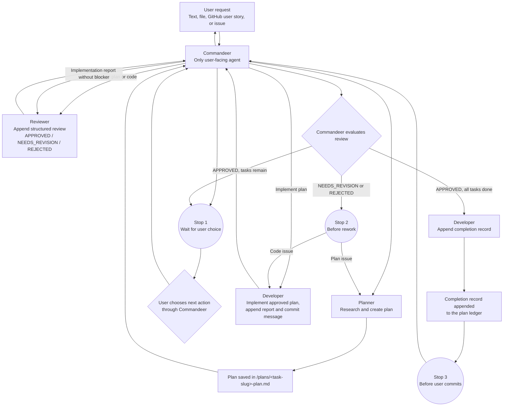

# Agent Orchestration

## Overview

The goal is to create an agent workflow for this repository. The orchestration framework consists of a master agent, **Commandeer**, which coordinates three specialized agents:

- **Planner**
- **Developer**
- **Reviewer**

## Repository Context

- The repository contains one or more Node.js projects intended for hosting on
  Microsoft Azure.
- All agents must treat Node.js and Azure hosting as fixed project constraints.
- Agents must not invent a Node.js version, framework, package manager, module
  system, or Azure hosting service. They must derive these choices from
  repository configuration or an approved plan and surface missing decisions
  through the plan ledger.
- Application code belongs in `/src`, tests in `/test`, and Azure Bicep
  infrastructure in `/deployment`.

## Supported Environments

The same agent profiles under `/.github/agents` must be available in:

- VS Code with GitHub Copilot;
- GitHub.com through Copilot cloud agent;
- GitHub Copilot CLI.

The profiles omit `target`, which makes them eligible for both `vscode` and
`github-copilot`. Copilot CLI also discovers repository agents from
`.github/agents`.

Use portable tool aliases (`agent`, `read`, `search`, `edit`, `execute`, and
`web`) whenever a capability is needed across environments. Product-specific
tools may be listed only as optional fallbacks; unsupported tool names are
ignored by other environments.

### Starting the workflow

- **VS Code:** select `Commandeer` in the Chat agent picker and submit the
  request.
- **GitHub.com:** merge the agent profiles into the repository's default branch,
  open Copilot agents, select the repository and `Commandeer`, and submit the
  request.
- **Copilot CLI:** from the repository root run
  `copilot --agent commandeer --prompt "<request>"`, or select `Commandeer` with
  `/agent` in an interactive session.

Planner, Developer, and Reviewer are not user-invocable. Commandeer invokes them
through the portable `agent` tool alias. In VS Code, the `agents` property
further limits Commandeer to those three specialists. Environments that do not
enforce that property rely on Commandeer's explicit role restriction and the
specialists' lack of the `agent` tool.

## Goals

- Accept a user request from text, a file, a GitHub user story, or a GitHub issue.
- Research the request and create an implementation plan.
- Let the user choose whether to implement or review the plan.
- Track workflow progress in an append-only plan ledger.
- Review either a plan or code changes.

## Requirements

- The user controls whether the workflow proceeds from planning to implementation or review.
- Plans must be saved in the `/plans` folder using the naming and structure defined in [Plan File Convention](#plan-file-convention).
- Only Commandeer may communicate directly with the user.
- Planner, Developer, and Reviewer must return all results and questions to Commandeer.
- Once written, a plan version is immutable. Rework creates a complete appended
  version rather than modifying an earlier version.
- The plan file is the workflow's durable communication ledger. User decisions and
  every specialized-agent result must be appended to it.
- The initial Planner invocation may carry the complete request and any referenced
  resource because no plan ledger exists yet; Planner must create the plan and
  append Entry 1 recording the request. For an existing workflow, agent
  invocations may carry only the plan path, requested role action, and exact user
  decision that the receiving specialist appends before using.
  All other substantive state and communication must be read from the plan ledger.
- The Reviewer must return findings using the structured format defined in [Review Output Format](#review-output-format).
- The Reviewer must be able to review both plans and code changes.
- Commandeer must stop and wait for user input at each point listed in [Stopping Rules](#stopping-rules).
- Commandeer must report progress using the fields defined in [State Tracking](#state-tracking).
- A completion record must be appended once all plan tasks are implemented and
  reviewed, per [Completion Records](#completion-records).
- Each agent is restricted to the tools listed in [Tool Boundaries](#tool-boundaries).
- Each agent must use its assigned model:
  - Commandeer: GPT-5.6 Terra
  - Planner: GPT-5.6 Sol
  - Developer: GPT-5.6 Sol
  - Reviewer: GPT-5.6 Terra

## Design

### Commandeer

**Model:** GPT-5.6 Terra

The coordination-only master agent that:

1. Receives the user request as text, a file, a GitHub user story, or a GitHub issue.
2. Passes the request to the Planner.
3. Presents the completed plan to the user.
4. Asks the user to choose between running the Developer or the Reviewer.
5. Coordinates any review and rework cycles.
6. Presents all agent results, questions, and status updates to the user without
   editing repository or workflow files.
7. Reports state using the [State Tracking](#state-tracking) fields on every turn.
8. Enforces the pauses defined in [Stopping Rules](#stopping-rules).
9. Passes each user decision to the next specialized agent so it is appended to
   the plan ledger before work proceeds.
10. Presents the Developer's proposed commit message to the user for manual commit.

### Planner

**Model:** GPT-5.6 Sol

The Planner:

1. Researches the request and relevant repository context.
2. Accounts for Node.js runtime and Azure hosting implications, including
   application configuration, deployment, observability, and tests when relevant.
3. Creates a clear, actionable implementation plan following the [Plan File Convention](#plan-file-convention).
4. Saves the plan in the `/plans` folder.
5. Appends clarifications and user decisions received through Commandeer.
6. Returns the plan path to Commandeer for presentation to the user.

The Planner never implements the plan, edits source code, or runs tests and
builds. After Commandeer presents the plan to the user, the Planner must not
change, remove, or renumber its summary or tasks.

### Developer

**Model:** GPT-5.6 Sol

The Developer:

1. Implements the approved plan.
2. Uses the repository-selected Node.js tooling and implements Azure-related
   configuration or Bicep only when required by the approved plan.
3. Does not create, revise, reinterpret, or expand the plan.
4. Appends an implementation report to the plan ledger without changing the
   approved plan content.
5. Proposes a git commit message for the completed work.
6. Appends a completion record per [Completion Records](#completion-records) after
   implementation receives final approval.
7. Returns the plan path to Commandeer.

If implementation requires a missing decision or a plan change, the Developer
must stop, append the blocker to the ledger, and return control to Commandeer.

### Reviewer

**Model:** GPT-5.6 Terra

The Reviewer can run after either the Planner or the Developer:

- After the Planner, it reviews the plan for completeness, correctness, and feasibility.
- After the Developer, it reviews the code changes against the plan and user request.
- It verifies relevant changes respect the established Node.js configuration and
  are suitable for the approved Azure hosting architecture.
- It appends findings using the [Review Output Format](#review-output-format).
- If issues are found, it appends clear feedback for rework and returns the plan
  path to Commandeer.

The Reviewer never changes the plan, implementation, or findings produced by
another agent. Its only write is appending its own review entry to the plan
ledger.

## Tool Boundaries

| Agent | Allowed actions | Not allowed |
|---|---|---|
| Commandeer | Invoke Planner, Developer, Reviewer; read plan files; message the user | Edit any file; run commands, tests, or builds |
| Planner | Read/search the repository, fetch GitHub issues, create a plan, append planning entries under `/plans` | Edit source code; run tests or builds; implement; mutate an approved plan |
| Developer | Read/edit source code, run focused tests and builds, append implementation entries under `/plans` | Plan or change plan content; review; message the user; commit |
| Reviewer | Read source code, diffs, and plan files; run non-mutating Git inspection commands; append review entries under `/plans` | Edit reviewed content; implement fixes; run mutating commands; message the user |

## Plan File Convention

- File path: `/plans/<task-slug>-plan.md`, where `<task-slug>` is a kebab-case summary of the request.
- Required structure:

```markdown
## Plan: {Task Title}

{1-3 sentence summary of what, how, and why.}

**Tasks**
1. **Task {N}: {Title}**
   - **Objective:** {What this task achieves}
   - **Files to change:** {List of files/functions}
   - **Steps:** {Ordered steps}
   - **Acceptance criteria:** {Measurable completion conditions}

**Open Questions**
1. {Clarifying question, with options if applicable}

## Ledger

### Entry {N}: {Entry type}

- **Actor:** User | Planner | Developer | Reviewer
- **Decision or result:** {Persisted decision, report, blocker, or finding}
- **Task progress:** {completed} of {total} tasks implemented
- **Next action:** {Action requiring Commandeer coordination}
```

- Commandeer treats a plan version as approved only after the user explicitly
  chooses to implement it.
- No agent may edit an existing plan version's summary, tasks, open questions,
  task numbering, objectives, scope, or acceptance criteria.
- Planner, Developer, and Reviewer may only append new, sequential entries under
  `## Ledger`.
- When plan rework is approved, Planner appends a complete revised plan version
  as a ledger entry. It becomes active only after explicit user approval.
- Ledger entries persist the original request, clarifications, user decisions,
  specialized-agent outputs, blockers, implementation progress, review outcomes,
  rework outcomes, and completion.
- Entry 1 is created by Planner and records the original request received during
  the initial Planner invocation.
- Commandeer reads the ledger and reports derived state to the user; it never
  writes ledger entries itself.

## Review Output Format

The Reviewer always appends this structure to the plan ledger:

```markdown
## Review: {Plan or Code Changes for <task title>}

**Status:** APPROVED | NEEDS_REVISION | REJECTED

**Summary:** {1-2 sentence overall assessment}

**Strengths:** {What was done well}

**Issues:** {If none, say "None"}
- **[CRITICAL | MAJOR | MINOR]** {Issue description with file/task reference}

**Recommendations:** {Specific, actionable suggestions}

**Next Steps:** {What Commandeer should do next}
```

## Stopping Rules

Commandeer must pause and wait for explicit user input at:

1. After the Planner returns the plan, before the user chooses Developer or Reviewer.
2. After the Reviewer returns a `NEEDS_REVISION` or `REJECTED` status, before starting rework.
3. After final review approval and the Developer appends the completion record
   and proposed commit message, before the user commits.
4. After the maximum rework attempts (see [Limitations](#limitations)) is reached.
5. Before exceeding the per-run credit limit (see [Limitations](#limitations)).

## State Tracking

On every turn, Commandeer reports:

- **Current stage:** Planning | Implementation | Review | Rework | Complete
- **Task progress:** `{completed}` of `{total}` tasks implemented
- **Last action:** What was just completed
- **Next action:** What happens next, pending user confirmation

## Completion Records

- The completion record is the final ledger entry in
  `/plans/<task-slug>-plan.md`; no separate completion file is created.
- The Developer appends it only after all plan tasks are implemented and the
  Reviewer has approved the code changes.
- Required contents:
  - Summary of what was accomplished.
  - List of files changed.
  - Final review status.
  - Proposed git commit message.

## Workflow



## Open Questions

<!-- List decisions that still need to be made. -->

## Limitations

- The maximum number of rework attempts is three.
- Each run must use no more than 2,000 credits. Commandeer must ask the user for permission before exceeding this limit.
- Only OpenAI models may be used.