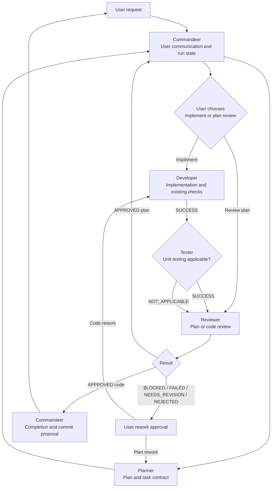

# Agent Orchestration

**Last reviewed:** 2026-09-21

## Overview

The repository uses a user-facing **Commandeer** agent to coordinate four
specialized agents:

- **Planner**
- **Developer**
- **Tester**
- **Reviewer**

The workflow separates the immutable implementation plan from mutable execution
state. This keeps approved scope stable while giving agents a compact,
authoritative handoff record.

## Repository Context

- The repository contains one or more Node.js projects intended for Microsoft
  Azure hosting.
- Agents derive the Node.js version, framework, package manager, module system,
  Azure service, and deployment approach from repository configuration or an
  approved plan.
- Application code belongs in `/src`, tests in `/test`, and Azure Bicep
  infrastructure in `/deployment`.
- Agent model selection is defined only in each executable `.agent.md` profile.

## Supported Environments

The profiles under `/.github/agents` must work in:

- VS Code with GitHub Copilot;
- GitHub.com through Copilot cloud agent;
- GitHub Copilot CLI.

Use portable tool aliases (`agent`, `read`, `search`, `edit`, `execute`, and
`web`) whenever a capability is needed across environments.

Planner, Developer, Tester, and Reviewer are not user-invocable. Commandeer
invokes them through the portable `agent` tool alias. The specialists do not
receive the `agent` tool.

## Goals

- Accept a request from text, a file, a GitHub user story, or a GitHub issue.
- Produce an implementation plan with explicit scope and acceptance criteria.
- Preserve user control at planning, rework, and completion gates.
- Share context through durable, reviewable artifacts instead of hidden chat
  state.
- Add focused unit tests when the implementation has unit-testable behavior.
- Review either a plan or completed implementation and test changes.
- Surface optional follow-up proposals without silently expanding scope.

## Workflow Artifacts

Each workflow uses two files with the same task slug.

### Plan file

Path: `/plans/<task-slug>-plan.md`

The plan is the durable task contract. It contains:

```markdown
# Plan: {Task Title}

## Original Request

{Verbatim request and referenced resources}

## Plan Version 1

**Summary:** {What, how, and why}

**Scope**
- {Included behavior or artifact}

**Non-goals**
- {Explicitly excluded behavior or artifact}

**Tasks**
1. **Task {N}: {Title}**
   - **Objective:** {What this task achieves}
   - **Files to change:** {Concrete files or symbols}
   - **Steps:** {Ordered implementation steps}
   - **Acceptance criteria:** {Measurable completion conditions}

**Open Questions**
1. {Question with choices when possible}
```

A plan version is immutable after Planner writes it. Approved rework appends a
complete `Plan Version N` section. The run file identifies which version is
active and approved.

### Run file

Path: `/plans/<task-slug>-run.md`

The run file is the execution record and contains:

```markdown
# Run: {Task Title}

## Current State

- **Plan path:** {/plans/<task-slug>-plan.md}
- **Active plan version:** {number or "not approved"}
- **Stage:** Planning | Implementation | Testing | Review | Rework | Complete | Blocked
- **Status:** {Current machine-readable status}
- **Task progress:** {completed} of {total}
- **Last action:** {Most recent completed transition}
- **Next action:** {Next transition or required user decision}
- **Rework attempts:** {0-3}

## Decisions

{Append-only user decisions with timestamps or sequence numbers}

## Artifact Manifest

{Current files and durable outputs produced by the workflow}

## Reports

{Append-only specialist reports}

## Completion

{Final summary and proposed commit message, written by Commandeer}
```

Commandeer may update `Current State`, `Artifact Manifest`, and `Completion`,
and may append exact user decisions under `Decisions`. Specialists only append
their own reports under `Reports`. Planner creates both files.

Agents read the active plan version, current state, applicable decisions,
artifact manifest, and latest relevant report. They do not need to reread old
reports unless the current state references one.

## Transition Contract

Every specialist invocation after initial planning contains only:

```yaml
planPath: /plans/<task-slug>-plan.md
runPath: /plans/<task-slug>-run.md
roleAction: <requested bounded action>
trigger: <transition trigger>
```

Allowed triggers:

- `NEW_REQUEST`: initial Planner invocation before artifacts exist.
- `USER_APPROVED`: the user approved a plan or selected a user-controlled path.
- `PREAUTHORIZED_NEXT_STAGE`: a previously approved workflow is advancing to
  its next non-destructive stage.
- `AUTOMATIC_VALIDATION`: implementation is advancing to testing or review.
- `REWORK_APPROVED`: the user approved a specific rework action.

Commandeer writes exact user decisions to the run file before invoking the next
specialist. Specialists record the trigger in their report; they never invent or
duplicate a user decision.

Every specialist report starts with:

```markdown
### Report {N}: {Actor} - {Action}

- **Status:** SUCCESS | NOT_APPLICABLE | BLOCKED | FAILED | APPROVED | NEEDS_REVISION | REJECTED
- **Trigger:** {Transition trigger}
- **Result:** {Concise outcome}
- **Files changed:** {Paths or "None"}
- **Validation:** {Commands and exact outcomes or "Not applicable"}
- **Optional proposals:** {Proposal IDs and summaries or "None"}
- **Recommended transition:** {Next workflow action}
```

If a proposal is required to satisfy the active plan, it is a blocker or review
finding rather than an optional proposal.

## Agent Responsibilities

### Commandeer

Commandeer is the only user-facing agent. It:

1. Sends a new request and referenced resources to Planner.
2. Presents the plan and waits for the user to choose implementation or plan
   review.
3. Records user decisions and workflow transitions in the run file.
4. Invokes specialists with the transition contract.
5. Advances successful, non-destructive stages without requesting a duplicate
   user decision.
6. Presents blockers and review failures before rework.
7. Updates the artifact manifest from specialist reports.
8. After approval, writes the completion record and derives the proposed commit
   message from the final artifact manifest and reports.
9. Presents optional proposals as separate follow-up choices.

Commandeer does not research, plan, implement, review source, run commands,
commit, or push. Its edit capability is limited to the run file.

### Planner

Planner:

1. Researches the request and relevant repository context.
2. Creates the plan and run files for a new request.
3. Defines explicit scope, non-goals, concrete tasks, acceptance criteria, and
   open questions.
4. Appends a complete plan version for approved plan rework.
5. Appends one planning report to the run file.

Planner does not implement, edit source or configuration, run tests or builds,
commit, or invoke another agent.

### Developer

Developer:

1. Implements only the active approved plan version.
2. Runs existing focused tests, checks, or builds so it does not knowingly hand
   broken code to Tester.
3. Does not add or expand unit-test coverage assigned to Tester.
4. Appends one implementation report, including changed files and validation
   evidence.

Developer does not revise the plan, perform independent review, generate the
final commit message, invoke another agent, commit, or push.

### Tester

Tester runs after an unblocked implementation report and first determines
testing applicability:

- `SUCCESS`: unit-testable behavior exists; focused unit tests were added or
  updated and the relevant test command passed.
- `NOT_APPLICABLE`: no unit-testable behavior exists, with a concise reason.
- `BLOCKED`: a production defect, missing decision, or invalid test boundary
  prevents correct tests.
- `FAILED`: the test command or test infrastructure failed unexpectedly.

Tester covers observable behavior, validation, error handling, and relevant
edge cases. Tester does not test dependency injection or logging and does not
edit production source or configuration.

### Reviewer

Reviewer can run:

- after Planner, to review a plan selected by the user;
- after Tester reports `SUCCESS` or `NOT_APPLICABLE`, to review implementation
  and test changes.

Reviewer appends one structured report and never edits reviewed content.

## Tool Boundaries

| Agent | Allowed actions | Not allowed |
|---|---|---|
| Commandeer | Invoke specialists; read plan and run files; edit only the run file; message the user | Research; edit plan, source, configuration, or tests; run commands; review code; commit |
| Planner | Read/search repository; fetch a referenced issue; create or append plan versions; create the run file; append planning reports | Edit implementation files; run tests or builds; implement; commit |
| Developer | Read/edit implementation files; run focused existing validation; append implementation reports | Revise plan; add Tester-owned unit coverage; review; message user; commit |
| Tester | Read implementation and tests; edit focused unit tests; run relevant unit tests; append testing reports | Edit production source or configuration; test dependency injection or logging; plan; review; commit |
| Reviewer | Read files and diffs; use non-mutating Git inspection; append review reports | Edit reviewed content; implement fixes; run mutating commands; message user; commit |

## Review Output

Reviewer includes this detail after the common report fields:

```markdown
#### Review: {Plan or Code Changes}

**Summary:** {Overall assessment}

**Strengths:** {What was done well}

**Issues:** {If none, say "None"}
- **[CRITICAL | MAJOR | MINOR]** {Issue with concrete reference}

**Recommendations:** {Specific advisory actions}
```

Status meanings:

- `APPROVED`: no material issues remain.
- `NEEDS_REVISION`: specific correctable issues remain.
- `REJECTED`: the approach is fundamentally unsafe, infeasible, or contrary to
  the request.

## Coordination Flow

1. Commandeer invokes Planner with `NEW_REQUEST`.
2. Planner creates the plan and run files and returns their paths.
3. Commandeer presents the plan and waits for the user to choose implementation
   or plan review.
4. Commandeer records the decision and invokes the selected agent with
   `USER_APPROVED`.
5. After Developer reports `SUCCESS`, Commandeer invokes Tester with
   `AUTOMATIC_VALIDATION`.
6. After Tester reports `SUCCESS` or `NOT_APPLICABLE`, Commandeer invokes
   Reviewer with `AUTOMATIC_VALIDATION`.
7. A blocker, failure, `NEEDS_REVISION`, or `REJECTED` result stops the workflow.
   Commandeer presents it and waits for explicit rework approval.
8. After code review reports `APPROVED`, Commandeer writes the completion record
   and final proposed commit message.
9. Commandeer presents delivered artifacts, validation evidence, deviations,
   decisions required, and optional proposals, then waits for the user's manual
   commit or next request.

## Stopping Rules

Commandeer waits for explicit user input:

1. After planning, before implementation or plan review.
2. After any blocker or unexpected failure.
3. After `NEEDS_REVISION` or `REJECTED`, before rework.
4. After three rework attempts.
5. After completion, before any commit, deployment, or follow-up proposal.

No duplicate approval is required for preauthorized testing and review stages.

## State Tracking

Every user-facing response contains:

- **Current stage:** Planning | Implementation | Testing | Review | Rework | Complete | Blocked
- **Task progress:** `{completed}` of `{total}` tasks implemented
- **Last action:** last persisted state transition
- **Next action:** next transition or required user confirmation

These fields are derived from `Current State` in the run file.

## Completion

Commandeer writes completion only after:

- all active plan tasks are implemented;
- Tester reports `SUCCESS` or `NOT_APPLICABLE`;
- Reviewer reports `APPROVED`.

Completion contains:

- accomplishment summary;
- final artifact manifest;
- validation summary;
- final review status;
- deviations from the active plan, or `None`;
- optional proposals;
- proposed Git commit message.

No additional Developer invocation is required for documentation-only
finalization.

## Workflow



## Limits

- Rework is limited to three user-approved attempts.
- Only OpenAI models may be used.
