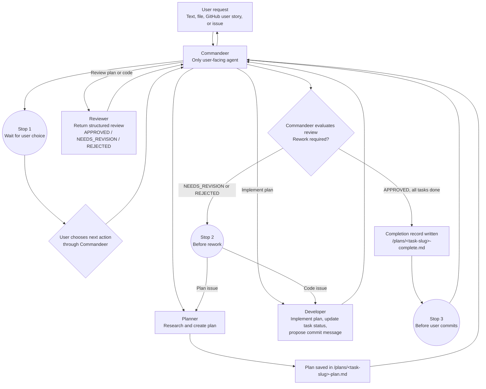

# Agent Orchestration

## Overview

The goal is to create an agent workflow for this repository. The orchestration framework consists of a master agent, **Commandeer**, which coordinates three specialized agents:

- **Planner**
- **Developer**
- **Reviewer**

## Goals

- Accept a user request from text, a file, a GitHub user story, or a GitHub issue.
- Research the request and create an implementation plan.
- Let the user choose whether to implement or review the plan.
- Track implementation progress in the plan.
- Review either a plan or code changes.

## Requirements

- The user controls whether the workflow proceeds from planning to implementation or review.
- Plans must be saved in the `/plans` folder using the naming and structure defined in [Plan File Convention](#plan-file-convention).
- Only Commandeer may communicate directly with the user.
- Planner, Developer, and Reviewer must return all results and questions to Commandeer.
- The Developer must update the plan as tasks are completed.
- The Reviewer must return findings using the structured format defined in [Review Output Format](#review-output-format).
- The Reviewer must be able to review both plans and code changes.
- Commandeer must stop and wait for user input at each point listed in [Stopping Rules](#stopping-rules).
- Commandeer must report progress using the fields defined in [State Tracking](#state-tracking).
- A completion record must be written for every finished task, per [Completion Records](#completion-records).
- Each agent is restricted to the tools listed in [Tool Boundaries](#tool-boundaries).
- Each agent must use its assigned model:
  - Commandeer: GPT-5.6 Terra
  - Planner: GPT-5.6 Sol
  - Developer: GPT-5.6 Sol
  - Reviewer: GPT-5.6 Terra

## Design

### Commandeer

**Model:** GPT-5.6 Terra

The master agent that:

1. Receives the user request as text, a file, a GitHub user story, or a GitHub issue.
2. Passes the request to the Planner.
3. Presents the completed plan to the user.
4. Asks the user to choose between running the Developer or the Reviewer.
5. Coordinates any review and rework cycles.
6. Presents all agent results, questions, and status updates to the user.
7. Reports state using the [State Tracking](#state-tracking) fields on every turn.
8. Enforces the pauses defined in [Stopping Rules](#stopping-rules).
9. Presents the Developer's proposed commit message to the user for manual commit.

### Planner

**Model:** GPT-5.6 Sol

The Planner:

1. Researches the request and relevant repository context.
2. Creates a clear, actionable implementation plan following the [Plan File Convention](#plan-file-convention).
3. Saves the plan in the `/plans` folder.
4. Returns the plan to Commandeer for presentation to the user.

### Developer

**Model:** GPT-5.6 Sol

The Developer:

1. Implements the approved plan.
2. Explains the changes made to Commandeer.
3. Marks completed tasks in the plan as implemented.
4. Proposes a git commit message for the completed work.
5. Writes a completion record per [Completion Records](#completion-records).
6. Returns the implementation results, commit message, and completion record to Commandeer.

### Reviewer

**Model:** GPT-5.6 Terra

The Reviewer can run after either the Planner or the Developer:

- After the Planner, it reviews the plan for completeness, correctness, and feasibility.
- After the Developer, it reviews the code changes against the plan and user request.
- It always returns findings using the [Review Output Format](#review-output-format).
- If issues are found, it returns clear feedback to Commandeer for rework.

## Tool Boundaries

| Agent | Allowed actions | Not allowed |
|---|---|---|
| Commandeer | Invoke Planner, Developer, Reviewer; read plan files; message the user | Edit code; write plan or completion files directly |
| Planner | Read/search the repository, fetch GitHub issues, write files under `/plans` | Edit source code; run tests |
| Developer | Read/edit source code, run tests and builds, update plan files under `/plans` | Message the user directly |
| Reviewer | Read source code and diffs, read plan files | Edit source code or plan files; message the user directly |

## Plan File Convention

- File path: `/plans/<task-slug>-plan.md`, where `<task-slug>` is a kebab-case summary of the request.
- Required structure:

```markdown
## Plan: {Task Title}

{1-3 sentence summary of what, how, and why.}

**Tasks**
1. **Task {N}: {Title}**
   - **Objective:** {What this task achieves}
   - **Files to change:** {List of files/functions}
   - **Steps:** {Ordered steps}
   - **Status:** Not started | In progress | Implemented

**Open Questions**
1. {Clarifying question, with options if applicable}
```

- The Developer updates each task's **Status** field as work progresses; it must not remove or renumber tasks.

## Review Output Format

The Reviewer always responds to Commandeer using this structure:

```markdown
## Review: {Plan or Code Changes for <task title>}

**Status:** APPROVED | NEEDS_REVISION | REJECTED

**Summary:** {1-2 sentence overall assessment}

**Strengths:** {What was done well}

**Issues:** {If none, say "None"}
- **[CRITICAL | MAJOR | MINOR]** {Issue description with file/task reference}

**Recommendations:** {Specific, actionable suggestions}

**Next Steps:** {What Commandeer should do next}
```

## Stopping Rules

Commandeer must pause and wait for explicit user input at:

1. After the Planner returns the plan, before the user chooses Developer or Reviewer.
2. After the Reviewer returns a `NEEDS_REVISION` or `REJECTED` status, before starting rework.
3. After the Developer completes implementation and proposes a commit message, before the user commits.
4. After the maximum rework attempts (see [Limitations](#limitations)) is reached.
5. Before exceeding the per-run credit limit (see [Limitations](#limitations)).

## State Tracking

On every turn, Commandeer reports:

- **Current stage:** Planning | Implementation | Review | Rework | Complete
- **Task progress:** `{completed}` of `{total}` tasks implemented
- **Last action:** What was just completed
- **Next action:** What happens next, pending user confirmation

## Completion Records

- File path: `/plans/<task-slug>-complete.md`, written by the Developer once all plan tasks are implemented and reviewed.
- Required contents:
  - Summary of what was accomplished.
  - List of files changed.
  - Final review status.
  - Proposed git commit message.

## Workflow



## Open Questions

<!-- List decisions that still need to be made. -->

## Limitations

- The maximum number of rework attempts is three.
- Each run must use no more than 2,000 credits. Commandeer must ask the user for permission before exceeding this limit.
- Only OpenAI models may be used.