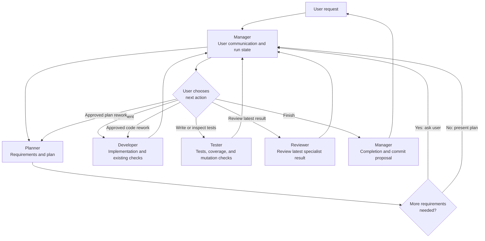

# Agent Orchestration

**Last reviewed:** 2026-09-27

## Overview

The repository uses a user-facing **Manager** agent to coordinate four
specialized agents:

- **Planner**
- **Developer**
- **Tester**
- **Reviewer**

The workflow separates the immutable implementation plan from mutable execution
state. This keeps approved scope stable while giving agents a compact,
authoritative handoff record.

## Repository Context

- The repository contains one or more Node.js projects intended for Microsoft
  Azure hosting.
- Agents derive the Node.js version, framework, package manager, module system,
  Azure service, and deployment approach from repository configuration or an
  approved plan.
- Application code belongs in `/src`, tests in `/test`, and Azure Bicep
  infrastructure in `/deployment`.
- Agent model selection is defined only in each executable `.agent.md` profile.

## Supported Environments

The profiles under `/.github/agents` must work in:

- VS Code with GitHub Copilot;
- GitHub.com through Copilot cloud agent;
- GitHub Copilot CLI.

Use portable tool aliases (`agent`, `read`, `search`, `edit`, `execute`, and
`web`) whenever a capability is needed across environments.

Planner, Developer, Tester, and Reviewer are not user-invocable. Manager
invokes them through the portable `agent` tool alias. The specialists do not
receive the `agent` tool.

## Goals

- Accept a request from text, a file, a GitHub user story, or a GitHub issue.
- Let Planner gather missing requirements and produce an implementation plan
   with explicit scope and acceptance criteria.
- Preserve user control after every specialist result.
- Share context through durable, reviewable artifacts instead of hidden chat
  state.
- Inspect tests, add focused missing coverage, measure coverage, and verify that
   meaningful tests detect controlled behavior mutations.
- Review the latest Planner, Developer, or Tester result when the user selects
   Reviewer.
- Surface optional follow-up proposals without silently expanding scope.
- Keep all validation local and isolated from real Azure, CI, and external
   resources.

## Workflow Artifacts

Each workflow uses two files with the same task slug.

### Plan file

Path: `/plans/<task-slug>-plan.md`

The plan is the durable task contract. It contains:

```markdown
# Plan: {Task Title}

## Original Request

{Verbatim request and referenced resources}

## Plan Version 1

**Summary:** {What, how, and why}

**Scope**
- {Included behavior or artifact}

**Non-goals**
- {Explicitly excluded behavior or artifact}

**Tasks**
1. **Task {N}: {Title}**
   - **Objective:** {What this task achieves}
   - **Files to change:** {Concrete files or symbols}
   - **Steps:** {Ordered implementation steps}
   - **Acceptance criteria:** {Measurable completion conditions}

**Open Questions**
1. {Question with choices when possible}
```

A plan version is immutable after Planner writes it. Approved rework appends a
complete `Plan Version N` section. The run file identifies which version is
active and approved.

### Run file

Path: `/plans/<task-slug>-run.md`

The run file is the execution record and contains:

```markdown
# Run: {Task Title}

## Current State

- **Plan path:** {/plans/<task-slug>-plan.md}
- **Active plan version:** {number or "not approved"}
- **Stage:** Requirements | Planning | Implementation | Testing | Review | Rework | Complete | Blocked
- **Status:** {Current machine-readable status}
- **Task progress:** {completed} of {total}
- **Last action:** {Most recent completed transition}
- **Next action:** {Next transition or required user decision}
- **Rework attempts:** {0-3}

## Decisions

{Append-only user decisions with timestamps or sequence numbers}

## Artifact Manifest

{Current files and durable outputs produced by the workflow}

## Reports

{Append-only specialist reports}

## Completion

{Final summary and proposed commit message, written by Manager}
```

Manager may update `Current State`, `Artifact Manifest`, and `Completion`,
and may append exact user decisions under `Decisions`. Specialists only append
their own reports under `Reports`. Planner creates both files.

Agents read the active plan version, current state, applicable decisions,
artifact manifest, and latest relevant report. They do not need to reread old
reports unless the current state references one.

## Transition Contract

Every specialist invocation after initial planning contains only:

```yaml
planPath: /plans/<task-slug>-plan.md
runPath: /plans/<task-slug>-run.md
roleAction: <requested bounded action>
trigger: <transition trigger>
```

Allowed triggers:

- `NEW_REQUEST`: initial Planner invocation before artifacts exist.
- `USER_RESPONSE`: Planner is processing answers to its requirements questions.
- `USER_SELECTED`: the user selected the next specialist and bounded action.
- `REWORK_APPROVED`: the user approved a specific rework action.

Manager writes exact user decisions to the run file before invoking the next
specialist. Specialists record the trigger in their report; they never invent or
duplicate a user decision.

Every specialist report starts with:

```markdown
### Report {N}: {Actor} - {Action}

- **Status:** SUCCESS | NEEDS_INPUT | NOT_APPLICABLE | BLOCKED | FAILED | APPROVED | NEEDS_REVISION | REJECTED
- **Trigger:** {Transition trigger}
- **Result:** {Concise outcome}
- **Files changed:** {Paths or "None"}
- **Validation:** {Commands and exact outcomes or "Not applicable"}
- **Optional proposals:** {Proposal IDs and summaries or "None"}
- **Recommended transition:** {Next workflow action}
```

If a proposal is required to satisfy the active plan, it is a blocker or review
finding rather than an optional proposal.

## Agent Responsibilities

### Manager

Manager is the primary user-facing agent. It:

1. Sends every new request and referenced resources to Planner.
2. Relays Planner's user-facing requirements questions unchanged, records the
   user's exact answers, and returns them to Planner until the plan is ready.
3. Presents every specialist result before asking the user to select the next
   action.
4. Records user decisions and workflow transitions in the run file.
5. Invokes only the specialist and bounded action selected by the user.
6. Presents blockers, failures, review findings, and proposed resolutions before
   requesting rework approval.
7. Updates the artifact manifest from specialist reports.
8. Writes completion and a proposed commit message only when implementation is
   finished and the user chooses to finish.

Manager does not research, plan, implement, test, review source, run commands,
commit, or push. Its edit capability is limited to the run file.

### Planner

Planner:

1. Owns requirements discovery and writes concise user-facing questions that
   Manager relays without reinterpretation.
2. Researches the request and relevant repository context.
3. Creates the plan and run files for a new request.
4. Reports `NEEDS_INPUT` while requirements remain unresolved.
5. Defines explicit scope, non-goals, concrete tasks, acceptance criteria, and
   validation once enough requirements are known.
6. Appends a complete plan version after user responses or approved plan rework.
7. Appends one planning report per invocation to the run file.

Planner does not implement, edit source or configuration, run tests or builds,
commit, or invoke another agent.

### Developer

Developer:

1. Implements only the active approved plan version.
2. Runs existing focused local tests, checks, or builds without accessing real
   services or CI systems.
3. Does not add or expand unit-test coverage assigned to Tester.
4. Appends one implementation report, including changed files and validation
   evidence.

Developer does not revise the plan, perform independent review, generate the
final commit message, invoke another agent, commit, or push.

### Tester

Tester runs only when selected by the user after an unblocked implementation
report and first determines testing applicability:

- `SUCCESS`: unit-testable behavior exists; focused tests were inspected and
   updated as needed, coverage was measured, controlled mutation checks proved
   the tests detect broken behavior, and the relevant test command passed.
- `NOT_APPLICABLE`: no unit-testable behavior exists, with a concise reason.
- `BLOCKED`: a production defect, missing decision, or invalid test boundary
  prevents correct tests.
- `FAILED`: the test command or test infrastructure failed unexpectedly.

Tester covers observable behavior, validation, error handling, and relevant
edge cases. It may make a small temporary production-code mutation only to prove
that a targeted test fails, must restore that mutation immediately, and must
rerun the test successfully. It never leaves production changes behind.

### Reviewer

Reviewer can run after Planner, Developer, or Tester when selected by the user.
It appends one structured report, proposes a concrete resolution for every
issue, and never edits reviewed content.

## Tool Boundaries

| Agent | Allowed actions | Not allowed |
|---|---|---|
| Manager | Invoke specialists; read plan and run files; edit only the run file; message the user | Research; edit plan, source, configuration, or tests; run commands; review code; commit |
| Planner | Read/search repository; fetch a referenced issue; create or append plan versions; create the run file; append planning reports; author user-facing requirements questions | Edit implementation files; run tests or builds; implement; commit |
| Developer | Read/edit implementation files; run focused local validation; append implementation reports | Revise plan; add Tester-owned unit coverage; review; access real resources; message user; commit |
| Tester | Read implementation and tests; edit focused tests; measure coverage; run tests and reversible mutation checks; append testing reports | Leave production mutations; access real resources; plan; review; commit |
| Reviewer | Read files and diffs; use local non-mutating inspection; append review reports and proposed resolutions | Edit reviewed content; implement fixes; access real resources; message user; commit |

All specialists must use mocks, fakes, fixtures, static analysis, or local
emulators that require no external account. They must not access Azure,
GitHub Actions, live APIs, deployed services, databases, queues, webhooks, or
other real resources for validation.

## Review Output

Reviewer includes this detail after the common report fields:

```markdown
#### Review: {Plan or Code Changes}

**Summary:** {Overall assessment}

**Strengths:** {What was done well}

**Issues:** {If none, say "None"}
- **[CRITICAL | MAJOR | MINOR]** {Issue with concrete reference, impact, and proposed resolution}

**Recommendations:** {Specific advisory actions}
```

Status meanings:

- `APPROVED`: no material issues remain.
- `NEEDS_REVISION`: specific correctable issues remain.
- `REJECTED`: the approach is fundamentally unsafe, infeasible, or contrary to
  the request.

## Coordination Flow

1. Manager invokes Planner with `NEW_REQUEST`.
2. If Planner reports `NEEDS_INPUT`, Manager presents Planner's questions,
   records the answers, and invokes Planner with `USER_RESPONSE`.
3. When Planner reports `SUCCESS`, Manager presents the plan and asks the user
   to choose Developer, Reviewer, or stop.
4. After Developer reports, Manager presents the implementation and local
   validation evidence, then asks the user to choose Tester, Reviewer, approved
   rework, finish, or stop.
5. After Tester reports, Manager presents test changes, coverage, and mutation
   evidence, then asks the user to choose Reviewer, approved rework, finish, or
   stop.
6. Reviewer may assess the latest Planner, Developer, or Tester result. Manager
   presents its findings and proposed resolutions, then asks the user to choose
   the next action.
7. A blocker, failure, `NEEDS_REVISION`, or `REJECTED` result never triggers
   automatic rework. Manager waits for explicit approval.
8. No specialist transition is automatic.

## Stopping Rules

Manager waits for explicit user input:

1. Whenever Planner requests requirements.
2. After every Planner, Developer, Tester, or Reviewer result.
3. Before any rework.
4. After three rework attempts.
5. After completion, before any commit, deployment, or follow-up proposal.

## State Tracking

Every user-facing response contains:

- **Current stage:** Requirements | Planning | Implementation | Testing | Review | Rework | Complete | Blocked
- **Task progress:** `{completed}` of `{total}` tasks implemented
- **Last action:** last persisted state transition
- **Result:** concise summary of the latest specialist report
- **Next action:** user-selectable transitions or required confirmation

These fields are derived from `Current State` in the run file.

## Completion

Manager writes completion only after all active plan tasks are implemented and
the user explicitly chooses to finish. Testing and review are user-selected,
not mandatory automatic stages; completion records either their evidence or
that the user skipped them.

Completion contains:

- accomplishment summary;
- final artifact manifest;
- validation summary;
- final review status;
- deviations from the active plan, or `None`;
- optional proposals;
- proposed Git commit message.

No additional Developer invocation is required for documentation-only
finalization.

## Workflow


```mermaid
flowchart TD
    User["User request"]
   Manager["Manager<br/>User communication and run state"]
   Planner["Planner<br/>Requirements and plan"]
   Requirements{"More requirements<br/>needed?"}
   Choice{"User chooses<br/>next action"}
    Developer["Developer<br/>Implementation and existing checks"]
   Tester["Tester<br/>Tests, coverage, and mutation checks"]
   Reviewer["Reviewer<br/>Review latest specialist result"]
   Complete["Manager<br/>Completion and commit proposal"]

   User --> Manager
   Manager --> Planner
   Planner --> Requirements
   Requirements -->|Yes: ask user| Manager
   Requirements -->|No: present plan| Manager
   Manager --> Choice
   Choice -->|Implement| Developer
   Choice -->|Write or inspect tests| Tester
   Choice -->|Review latest result| Reviewer
   Choice -->|Approved plan rework| Planner
   Choice -->|Approved code rework| Developer
   Developer --> Manager
   Tester --> Manager
   Reviewer --> Manager
   Choice -->|Finish| Complete
    Complete --> User
```

## Limits

- Rework is limited to three user-approved attempts.
- Only OpenAI models may be used.
